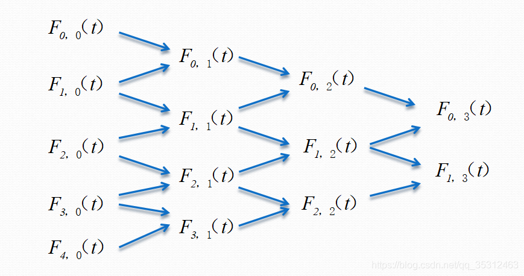

+++
author = 'libo'
date = '2026-01-24T11:45:01+08:00'
math= true
draft = false
title = 'B样条曲线'
image = "wuyun.png"
+++

b样条曲线的卷积连续形式推导（下面的$B_0$ 默认都是定义在初始区间的）:

$ B_0\left(x\right)=1 ,0\le x \le 1 $

$B_d(x)=\int B_{d-1}\left(y\right)B_0\left(x-y\right)dy=\int_{x-1}^{x}B_{d-1}\left(y\right)B_0\left(x-y\right)dy$

$B_d\left(x\right)=\int_{x-1}^{x}B_{d-1}\left(y\right)dy=\int_{x-1}^{0}B_{d-1}\left(y\right)dy + \int_{0}^{x}B_{d-1}\left(y\right)dy$

$=\int_{x}^{1}B_{d-1}^{i+1}\left(y\right)dy + \int_{0}^{x}B_{d-1}^{i}\left(y\right)dy$

b样条曲线不同阶的基函数递推公式：




下面是一份比较系统、偏“教材式”的 B 样条曲线理论介绍，我会按定义、基函数、性质、算法、扩展（NURBS）这个逻辑来讲。
## 一、先看直观结论
- B 样条曲线是一条分段多项式参数曲线，由一组控制点和一组 B 样条基函数通过线性组合生成。
- 它的关键优点：
  - 局部支撑：改动一个控制点只影响曲线的局部一段。
  - 低次分段：即使控制点很多，每一段仍然是低次多项式，易于计算和数值稳定。
  - 良好的几何性质：凸包性、变差缩减性、C^k−p−1 连续性（p 为节点重复度）等。
- 它是贝塞尔曲线的推广，也是 NURBS（非均匀有理 B 样条）的基础。


## 三、基本概念
### 1. 样条（spline）
- 历史上：样条是一根弹性木条，被一组“压块”固定后自然弯曲，用来通过给定点绘制光滑曲线。
- 数学上：样条是分段定义的多项式函数，在分段连接处满足一定的连续性（比如 C^2）。
- B 样条的 “B” 代表 “basis”（基）：B 样条基函数就是构造这类分段多项式曲线的一组“基础函数”。
### 2. 控制点与控制多边形
- 给定 n+1 个控制点 P_0, P_1, …, P_n（在二维/三维空间中的点），把它们依次连接形成的折线称为“控制多边形”。
- B 样条曲线一般不经过这些控制点（除非特殊设置节点重复等），但会被它们“吸引”和约束：曲线大致沿着控制多边形的形状。
### 3. 节点（knot）与节点向量
- 在参数轴上给定一串非递减的数：
  T = {t_0, t_1, …, t_m},   t_i ≤ t_{i+1}
- 每个 t_i 叫做一个节点（knot），T 叫做节点向量（knot vector）。
- 常见分类：
  - 均匀（uniform）：节点间距相等，如 {0,1,2,3,4,5}。
  - 非均匀（non‑uniform）：节点间距可任意，如 {0,0,0,1,2,3,4,4,4}。
  - 准均匀（quasi‑uniform）：内部均匀，首尾重复一定次数。
- 节点重复度（multiplicity）：某个节点连续出现的次数。重数会影响曲线在该点的连续性：一般地，在重复度为 p 的节点处，曲线连续性降为 C^{k-p-1}（k 为阶数）。
### 4. 阶数（order）与次数（degree）
- 阶数 k：基函数的“高度”，常指“p+1 阶”，即基函数最大支撑区间包含 k 个节点段。
- 次数 p：多项式的最高幂次，满足 p = k − 1。
- 工程中常用：
  - 二次 B 样条（p=2，k=3）
  - 三次 B 样条（p=3，k=4），是 CAD 中最常用的选择（兼顾光滑与可控）。
## 四、B 样条基函数（de Boor–Cox 递推）
### 1. 节点向量长度与控制点数关系
- 若有 n+1 个控制点 P_0…P_n，基函数为 k 阶（p = k−1 次），则节点向量长度至少为 m+1 = n + k + 1（常取正好 n+k+1 个节点）。
- 参数 t 的定义域：t ∈ [t_{k−1}, t_{n+1}]（两端多余节点主要用于支撑基函数）。
### 2. 1 阶（p=0）基函数：阶梯函数
定义：
```
N_{i,1}(t) = 
    1,   t_i ≤ t < t_{i+1}
    0,   其他
```
特点：只在区间 [t_i, t_{i+1}) 上为 1，其它地方为 0。也称为“特征函数”或“箱函数”。
### 3. k 阶（p=k−1）基函数递推公式（de Boor–Cox）
递推定义：
```
N_{i,k}(t) = (t - t_i)/(t_{i+k-1} - t_i) * N_{i,k-1}(t)
           + (t_{i+k} - t)/(t_{i+k} - t_{i+1}) * N_{i+1,k-1}(t)
```
约定：当分母为 0 时，对应项取 0。
这个公式通过低阶基函数构造高阶基函数，是整个 B 样条理论的核心。
### 4. 基函数的关键性质
- 局部支集（local support）：
  - N_{i,k}(t) > 0 当且仅当 t ∈ (t_i, t_{i+k})；
  - 在此区间外，N_{i,k}(t) = 0。
  - 这意味着每个基函数只在最多 k 个节点区间上非零。
- 正性（positivity）：
  - 在支集内部，N_{i,k}(t) > 0。
- 单位分解（partition of unity）：
  - 在定义域内，∑_i N_{i,k}(t) = 1；
  - 保证曲线的仿射不变性。
- 递推结构：
  - 高阶基函数是两个低阶基函数的线性插值组合。
- 连续性：
  - 在重复度为 p 的节点处，N_{i,k}(t) 具有 C^{k-p-1} 连续性；
  - 若节点不重复，则内部节点处 C^{k-1} 光滑。
- 紧支与最小支撑：
  - 在给定次数和节点序列下，B 样条基函数是具有最小支集的一组基。
## 五、B 样条曲线的数学定义
### 1. 曲线表达式
给定控制点 P_0,…,P_n，k 阶 B 样条基函数 N_{i,k}(t)，则 B 样条曲线定义为：
```
p(t) = ∑_{i=0}^n P_i * N_{i,k}(t),   t ∈ [t_{k-1}, t_{n+1}]
```
- 每个 N_{i,k}(t) 是一个“权重函数”，决定 P_i 在不同参数 t 处对曲线的贡献。
- 与贝塞尔曲线对比：贝塞尔是全局伯恩斯坦基，一个点影响整个曲线；B 样条是局部基，一个点只影响局部。
### 2. 几何解释
- 对任意固定 t，N_{i,k}(t) ≥ 0 且和为 1，因此 p(t) 是控制点 P_i 的加权平均（凸组合）。
- 曲线整体位于控制多边形的“凸包”（所有控制点的凸包）的内部；更精确地说，每一段曲线位于相关的 k 个控制点的局部凸包内（局部凸包性质）。
## 六、B 样条曲线的重要性质
### 1. 局部控制（local control）
- 由于 N_{i,k}(t) 的局部支集，改动 P_i 只会改变曲线在区间 (t_i, t_{i+k}) 上的部分，其他部分保持不变。
- 这使得 B 样条非常适合交互式建模和局部形状调整。
### 2. 凸包性（convex hull property）
- 对任意 t，p(t) 都是某 k 个控制点的凸组合，因此：
  - 每一段曲线落在对应的 k 个控制点张成的凸包内；
  - 整条曲线落在控制多边形的全局凸包内。
### 3. 变差缩减性（variation diminishing property）
- 任意一条直线与 B 样条曲线的交点个数不超过该直线与控制多边形的交点个数。
- 直观含义：曲线不会比控制多边形产生更多的“波动”，形状更“简单”。
### 4. 连续性（smoothness）
- 在无重节点的区间内部，曲线是 C^∞ 的多项式；
- 在节点 t_j 处，若其重复度为 p_j，则曲线在该点连续性为：
  - C^{k-p_j-1}（例如三次 B 样条 k=4：若节点重复 1 次，则 C^2；若重复 2 次，则 C^1）。
- 通过调整节点重复度，可以在光滑性和插值需求之间折中（例如端点插值）。
### 5. 仿射不变性（affine invariance）
- 对控制点做任意仿射变换（平移、旋转、缩放、剪切等），等效于对整条曲线做相同的变换；
- 源于 ∑ N_{i,k}(t) = 1 的单位分解性质。
### 6. 可微性（导数公式）
- 对 p(t) 求导，可得到由低一阶 B 样条基函数表示的导数曲线；
```
p'(t) = (k-1) * ∑_{i} (P_{i+1} - P_i)/(t_{i+k} - t_{i+1}) * N_{i+1,k-1}(t)
```
- 这意味着 B 样条曲线的导数仍然是 B 样条曲线（控制点为差分向量）。
### 7. 端点插值能力（通过节点重复）
- 若让首尾节点重复度为 k（例如 t_0 = … = t_{k−1}，t_{n+1} = … = t_{n+k}），则曲线：
  - 在首端点 P_0 和末端点 P_n 处插值（通过这两个点）；
  - 在端点处的切线也由相邻控制点确定（类似贝塞尔端点行为）。
## 七、de Boor 算法：计算 B 样条曲线上的点
de Boor 算法是 B 样条曲线求值的“核心算法”，类似于贝塞尔曲线的 de Casteljau 算法。它是一个递归的线性插值过程，稳定且易于实现。
### 1. 基本思想
- 给定参数 t，找到 t 所在的节点区间 [t_j, t_{j+1})；
- 找到受该区间影响的 k 个控制点（例如 P_{j−k+1}, …, P_j）；
- 通过 k−1 轮线性插值，递归构造中间点，最后得到 p(t)。
### 2. 算法步骤（简略版）
- 输入：
  - 节点向量 T = {t_0,…,t_m}；
  - 控制点 P_0,…,P_n；
  - 阶数 k（次数 p = k−1）；
  - 参数 t ∈ [t_{k−1}, t_{n+1}]。
- 步骤：
  1) 找到节点区间索引 j，使得 t_j ≤ t < t_{j+1}；
  2) 取出相关控制点 d_{i,0} = P_{j−k+i+1}，i = 0,…,k−1；
  3) 对 r = 1,…,k−1，i = k−1−r,…,0，计算：
     α_{i,r} = (t - t_{j−k+i+r+1}) / (t_{j+i+1} - t_{j−k+i+r+1})  
     d_{i,r} = (1 − α_{i,r}) * d_{i,r−1} + α_{i,r} * d_{i+1,r−1}
  4) 最终 p(t) = d_{0,k−1}。
- 特点：每一步都是线性插值，数值稳定；可直接推广到计算导数（差分构造）。
## 八、节点插入、升阶与细分（略述）
- 节点插入（knot insertion）：
  - 在节点向量中增加一个新节点（可重复），可以在不改变曲线形状的前提下增加控制点（细分）；
  - 典型算法：Boehm 的节点插入算法、Oslo 算法等。
- 升阶（degree elevation）：
  - 提高曲线的次数（k→k+1），而不改变曲线形状；
  - 代价是控制点数量增加，类似贝塞尔曲线的升阶。
- 这些操作在建模系统中用于局部编辑和拼接 B 样条曲线或曲面。
## 九、均匀、非均匀、有理 B 样条（NURBS）
### 1. 均匀 B 样条（uniform B‑spline）
- 节点均匀分布，如 {0,1,2,3,…}；
- 基函数平移等价，N_{i,k}(t) = N_{0,k}(t − i)；
- 计算简单，适合规则曲线（如闭合周期曲线），但对不规则数据拟合不够灵活。
### 2. 非均匀 B 样条（non‑uniform B‑spline）
- 节点分布任意，可以在某些区域加密节点以获得更高局部精度；
- 更灵活，适合表示不规则几何，是 CAD 系统中最常用形式。
### 3. 有理 B 样条 / NURBS
- NURBS：Non‑Uniform Rational B‑Spline，非均匀有理 B 样条，是 B 样条的有理推广，给每个控制点附加一个权重 w_i：  
  
```
R(t) = ∑_{i=0}^n w_i P_i N_{i,k}(t) / ∑_{i=0}^n w_i N_{i,k}(t)
```
- 当所有 w_i 相等时，退化为普通 B 样条。
- 优点：能精确表示圆锥曲线、圆、球等解析几何对象（普通多项式 B 样条做不到）。
- 性质：继承 B 样条的所有几何性质（局部性、凸包性等），并具有投影不变性。
## 十、B 样条曲线 vs 贝塞尔曲线：简略对比
- 基函数：
  - 贝塞尔：全局伯恩斯坦基，一个点影响整个区间；
  - B 样条：局部基，一个点只影响局部。
- 拼接：
  - 贝塞尔：若要拼接光滑曲线，需要精心匹配边界处控制点；
  - B 样条：由节点和基函数自动保证连续性，更容易拼接。
- 灵活性：
  - B 样条通过调节节点向量可实现局部加密和端点插值；
  - NURBS 进一步统一了自由曲线与解析曲线。
## 十一、应用场景
- CAD/CAM：船体、汽车、飞机外形等自由曲线曲面建模；
- 计算机图形学：动画曲线、路径设计、几何建模；
- 数值分析：数据拟合、插值与平滑、有限元等；
- 机器人/运动规划：轨迹生成、平滑路径等。
## 十二、总结与学习建议
- 理论上，B 样条的核心就是“一组具有局部支集、分段多项式的基函数” + “de Boor–Cox 递推公式” + “控制点线性组合”。
- 实践上，要真正掌握，建议：
  - 手算 1~2 个简单例子（如均匀二次或三次 B 样条、3~4 个控制点）的基函数，再代入不同参数 t 求点；
  - 编写一个小程序，实现 de Boor 算法，并在交互界面拖动控制点观察曲线变化；
  - 进一步尝试节点插入和升阶，理解它们对控制点和曲线形状的影响。
  如果你接下来希望看到具体例子的手算过程（比如给定节点向量和控制点，画出 N_{i,3}(t) 并计算 p(t)），或者想看 B 样条曲面的张量积构造，可以告诉我，我可以按具体例题一步步拆解。


在信号处理和数学中，**门函数**（通常也称为矩形函数）是构建各种复杂信号的基础。为了给出最通用且严谨的公式，我们先定义基础门函数，然后再推导二次和三次卷积。

### 1. 基础门函数定义

假设门函数的高度为 $A$，宽度为 $T$，且关于原点对称，其公式为 $g_1(t)$：
$
g_1(t) = A \cdot \text{rect}\left(\frac{t}{T}\right) = 
\begin{cases} 
A, & |t| \le \frac{T}{2} \\ 
0, & \text{其他} 
\end{cases}
$

*(注：如果你使用的是单位门函数，只需在后续公式中令 $A=1, T=1$ 即可)*

---

### 2. 门函数的二次卷积 $g_2(t)$

门函数与自身卷积一次，会得到一个**三角形函数**。其底边宽度会翻倍变成 $2T$，峰值为原来面积 $A \times T$ 乘以 $A$，即 $A^2 T$。
$
g_2(t) = g_1(t) * g_1(t) = 
\begin{cases} 
A^2 (t + T), & -T \le t \le 0 \\ 
A^2 (-t + T), & 0 < t \le T \\ 
0, & \text{其他} 
\end{cases}
$
**用标准三角形函数表示为：**
$ g_2(t) = A^2 T \cdot \Lambda\left(\frac{t}{T}\right) $
*(其中 $\Lambda(x) = \max(1 - |x|, 0)$ 是标准三角形函数)*

---

### 3. 门函数的三次卷积 $g_3(t)$

门函数与自身卷积两次（即三角形函数再与门函数卷积），会得到一个**分段二次函数**（二次样条曲线）。这是图像处理中“三次卷积插值”的核心基底函数。
其底边宽度变为 $3T$（从 $-1.5T$ 到 $1.5T$），峰值为 $g_2$ 的峰值面积乘以 $A$，即 $\frac{3}{4} A^3 T^2$。
$
g_3(t) = g_2(t) * g_1(t) = 
\begin{cases} 
A^3 \left( \frac{1}{2}t^2 + \frac{3}{2}Tt + \frac{9}{8}T^2 \right), & -\frac{3T}{2} \le t \le -\frac{T}{2} \\ 
A^3 \left( -t^2 + \frac{3}{4}T^2 \right), & -\frac{T}{2} < t \le \frac{T}{2} \\ 
A^3 \left( \frac{1}{2}t^2 - \frac{3}{2}Tt + \frac{9}{8}T^2 \right), & \frac{T}{2} < t \le \frac{3T}{2} \\ 
0, & \text{其他} 
\end{cases}
$

---

### 💡 补充：如果你需要的是“单位门函数” ($A=1, T=1$)

很多教材直接使用宽度为2（从-1到1）的单位门函数 $rect(t)$，此时公式会大大简化：
**一次（原函数）：**
$ g_1(t) = \begin{cases} 1, & |t| \le 1 \\ 0, & \text{其他} \end{cases} $
**二次卷积：**
$ g_2(t) = \begin{cases} t + 1, & -1 \le t \le 0 \\ -t + 1, & 0 < t \le 1 \\ 0, & \text{其他} \end{cases} $
**三次卷积：**
$
g_3(t) = 
\begin{cases} 
\frac{1}{2}t^2 + \frac{3}{2}t + \frac{9}{8}, & -\frac{3}{2} \le t \le -\frac{1}{2} \\ 
-t^2 + \frac{3}{4}, & -\frac{1}{2} < t \le \frac{1}{2} \\ 
\frac{1}{2}t^2 - \frac{3}{2}t + \frac{9}{8}, & \frac{1}{2} < t \le \frac{3}{2} \\ 
0, & \text{其他} 
\end{cases}
$

### 🔍 规律与性质总结

1. **平滑性递增**：门函数（0阶导数连续） $\rightarrow$ 二次卷积（1阶导数连续，呈三角尖峰） $\rightarrow$ 三次卷积（2阶导数连续，呈光滑钟形）。
2. **支撑区间**：每次卷积，非零区间的宽度都会增加一个原门函数的宽度 $T$。
3. **逼近高斯函数**：根据中心极限定理，如果无限次地将门函数与自身卷积，其波形最终会趋近于完美的**高斯函数（正态分布曲线）**。三次卷积已经是高斯函数的一个相当不错的近似。
