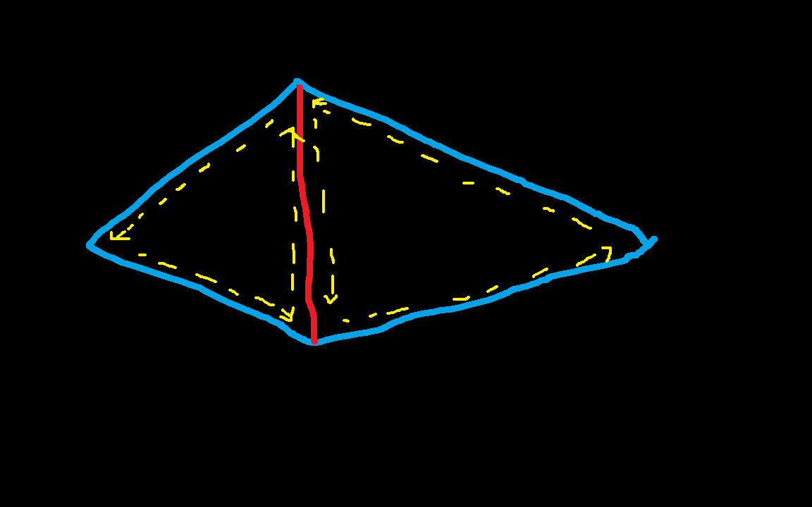
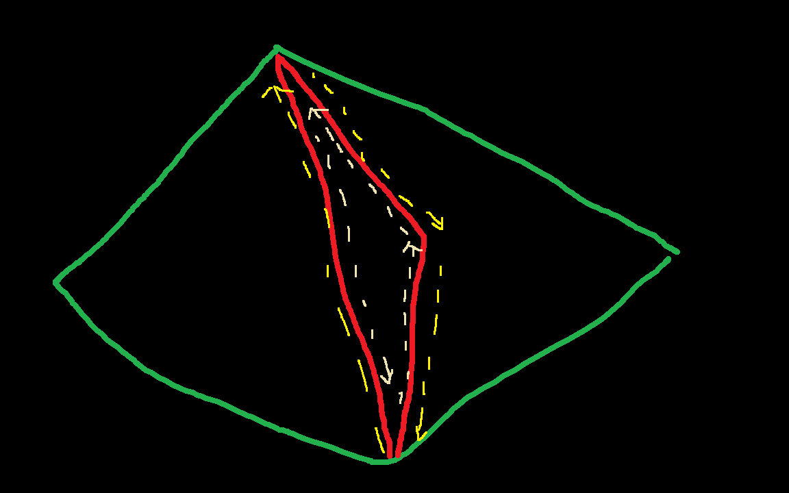
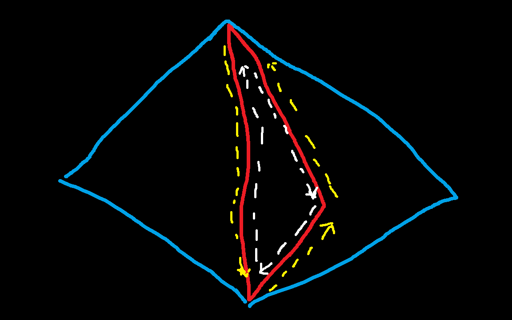
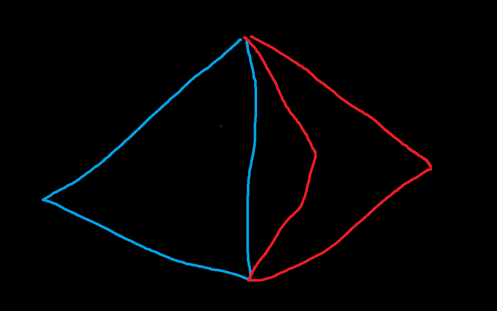
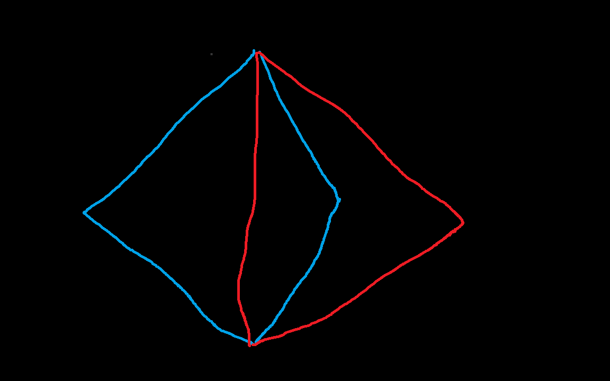

+++
author = 'libo'
date = '2026-03-11T11:13:13+08:00'
math= true
draft = false
image = '布尔.jpg'
title = '一种bool运算'
+++

求两个cell相交，不用判断是否平行等，直接遍历每个组件点，线，面，体....，然后求两两之间的交点即可。注意这里的点，线，面都是除去各自边界的开集，不是闭集。点的边界是空集，所以点是即开又闭的集合。

注意当三角形出现退化时，它的点，线（去除边界的开集），面（去除边界的开集）要么存在，要么为空，所以判断各个组件的相交在三角形退化时也是固定的，简单的。

#### 退化边界膨胀为单纯形后的剖分

如下的情况和边界方向：

红边替换为如下两种情况的三角形（其实是一种情况，只是从二维方向看来是两种情况，一种是顺时针的三角形，一种是逆时针。二者剖分后的情况看起来，一种交叠，一种不交叠，但是从拓扑看来其实是一种情况，这里为了说明与空间位置无关，所以故意分两种）。

他们的剖分情况如下:

