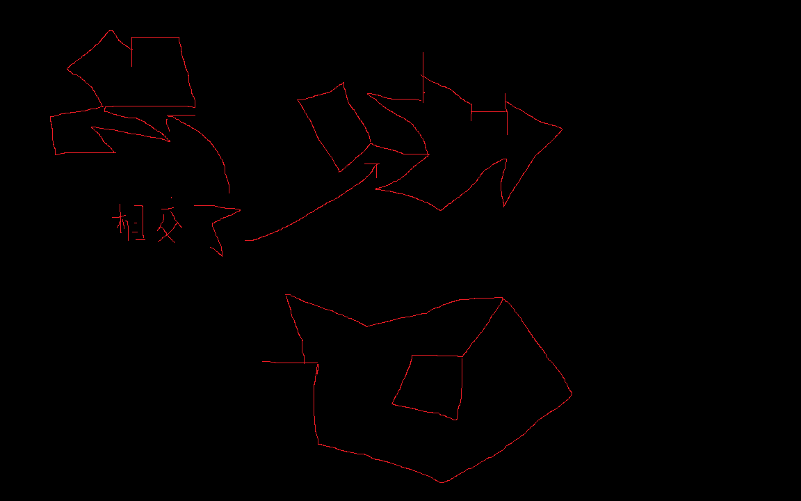
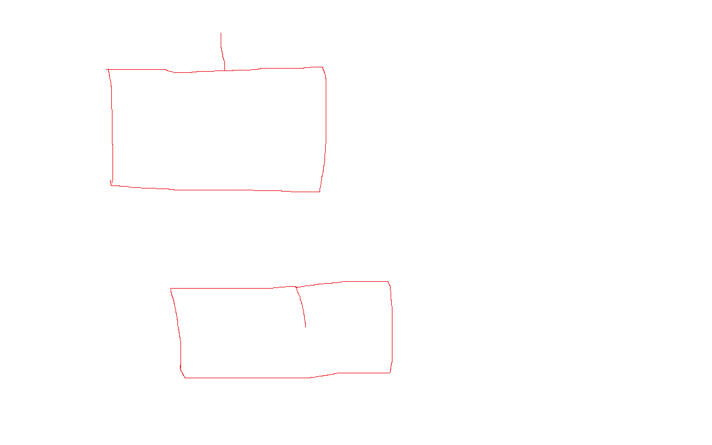

+++
author = 'libo'
date = '2026-03-17T15:23:49+08:00'
math= true
draft = false
image = 'linjie.png'
title = '对于多边形临界角度的判断'
+++

封面的完整图如下，他展示了几种临界情况:

对于多边形出现退化的情况，也就是   

也就是出现折叠的情况，上面折叠顶点的内角，一个是凸的0度，一个是凹的2pi。但是在计算中，由于无法确定方向，自然无法确定凸凹。
此外在旋转指标定理中，这个折叠点的旋转角度是pi,但是方向（正负）无法确定。

而且还可能出现 多个这种临界情况。

这里我们先解决定向问题。对于这种不能确定$ pi $方向的情况，我们可以在计算旋转指标定理时，删除所有临界点（注意是删除，不是忽略），然后即可计算，最终结果是2pi * n,n是方向。

但此时只能解决定向问题，每个临界点方向仍未确定。

为了确定每个临界点的方向，我们只需要把所有其他临界点删除，此时只剩下一个临界点，由于所有的点旋转角度乘以方向之和是2pi*n, 这样就确定这个临界点的方向，其他临界点类似。

确定好了方向，自然顶点的内角的凸凹也就确定了。

注意是删除临界点，而不是忽略临界点，因为删除意味者改变拓扑结构，
忽略(continue)只是不让这个临界点参与计算
