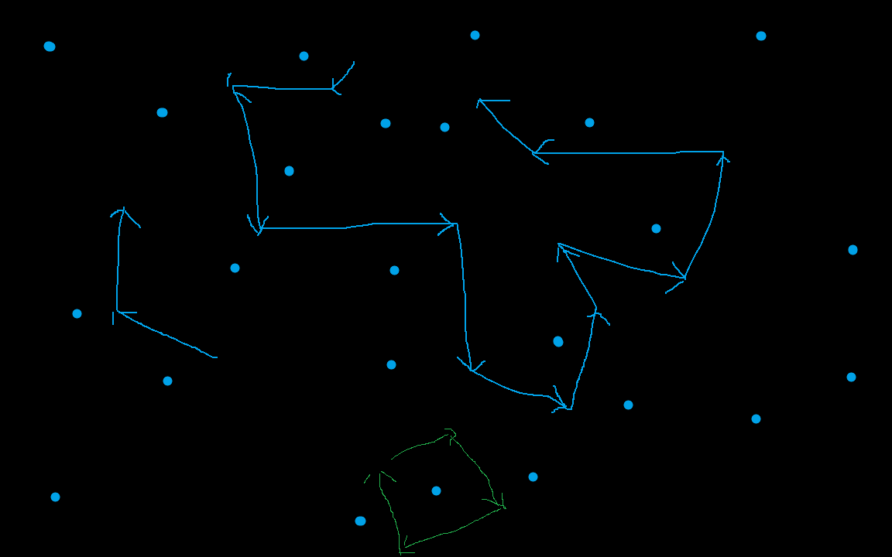

+++
author = 'libo'
date = '2026-03-24T14:59:24+08:00'
math= true
draft = false
title = '局部点云重建网格'
image = 'pic_d_03.jpg'
+++

在局部点云重建网格时，给定一个邻域点集，包含一些属于网格的点，它有些是网格边界点，有些是内点。在这样的情况下，我们想实现一个稳定的局部重建网格算法。

第一种方法是滚球法，可以先研究。

第二种方法，要尽量避免法向的判断加入进去，避免形成各种空洞

为了确定投影平面，也就是法向。这里是一种计算方式，当然用户可以指定任意平面（法向）。这里描述一些方法。

第一步：初步过滤和预处理。

给定一个点，和搜索半径r, 那么首先删除网格的内点，然后估算法向$n_1$，估算$n_1$是所有点的加权平均（也就是删除内点，边界点权重更大，然后法向的加权平均），

删除那些点的法向和$n_1$相反的点（也就是内积小于0），如果这样的点超过总数的1/3（或者其他阙值），此时缩短半径重复上述流程，或者一步到位，直接搜索最近的两个点，那么此时刚好有三个点，此时如果仍然存在点的法向和估算法向相反的情况就跳过重建。

第二步：计算拟合平面，也就是计算法向。

加权主成分分析，边界点的权重要大一点。此时可以根据几个方向的特征值如果相差不大，也就是不够扁平，那么也可以跳过此时重建。或者继续。 如果继续，则要继续删除法向和此时拟合的法向相反的点。

此时存在边界点，但是边界点参加重建容易造成拓扑链接错误。故此时要把边界点都替换为边界线段。也就是的边界点相连的两个边都要加进去，并替换原来的边界点。

第四步：开始投影重建。

投影之后形成如下情况。由于是边界，所以存在方向，我用箭头表示。

当然我可以此时直接进行delaunay剖分，然后插入边。

但是我们可以采用下面方法，过滤一些点。对于段曲线，我们可以拟合一条直线，这些曲线在各自的拟合直线投影后的首尾点和右手定则能确定直线的方向和垂直方向，

我们需要移动这些直线，让曲线的点刚好都在直线的垂直方向一侧。此时保留所有的曲线和那些位于所有直线垂直方向一侧交集区域的点。

然后再delaunay剖分，然后插入边。
